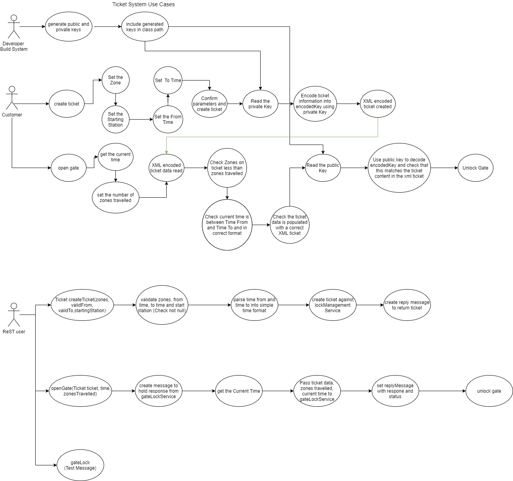
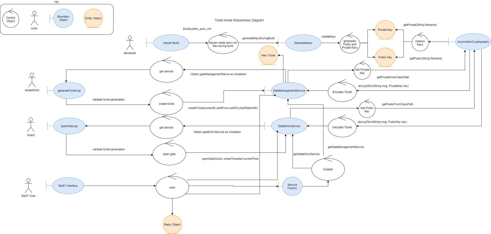
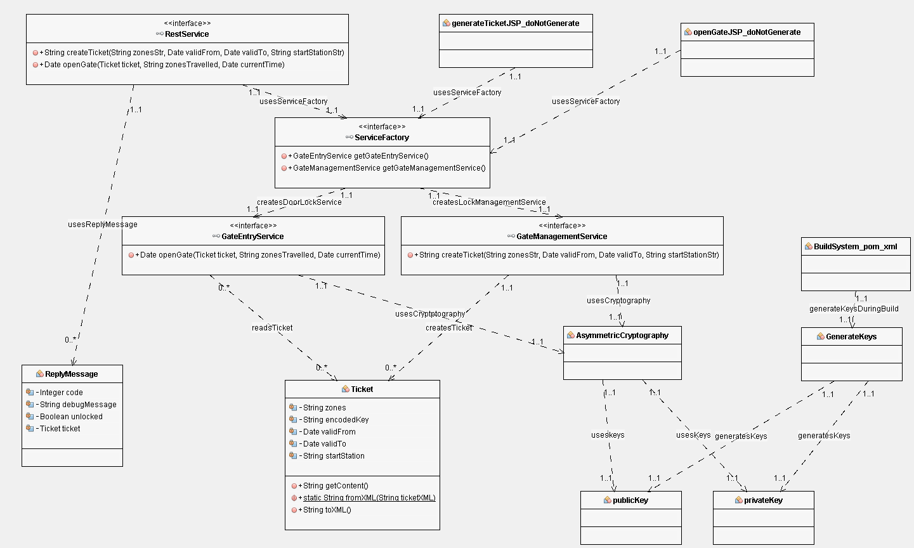

# Draw IO

You will be constructing our use cases using Draw IO

Draw IO (https://www.draw.io/) is a simple on line javascript based drawing library which can construct UML diagrams in your browser. 
Images can be saved and loaded as xml files within your project and exported as images which can be included in your documentation.

# Initial Diagrams

## Ticket System use case diagram

## Ticket System System Robustness Diagram 

## Ticket System Class Diagram

